# Runnerz Namibia — Android Product Case Study


**A route-driven social running network built in Windhoek, for Namibia.**

[Runnerz Namibia](https://runnerznamibia.com) · [Instagram](https://www.instagram.com/runnerz.na/) · [Facebook](https://www.facebook.com/runnerz.na/) · [LinkedIn](https://www.linkedin.com/company/runnerz-na/)

> This is a public product case study. The Android source, Supabase configuration, migrations, credentials, signing material and operational implementation remain in a separate private repository.

## My role

**Freeman Ipumbu — Founder, product builder and design researcher**

I shaped Runnerz from the product thesis through brand direction, interaction design, Android engineering, route architecture, trust and safety language, backend foundations, real-device QA and launch planning.

## The problem

Running communities rarely fail because people dislike running. They fragment because intent, pace, place, timing and trust are difficult to align.

Runnerz is built around a more useful social loop:

```text
SEE A RUNNER → UNDERSTAND THE MATCH → PROPOSE A RUN →
MEET IN PUBLIC → RUN TOGETHER → CONFIRM IT → BUILD TRUST
```

It is not a follower network wearing running clothes. The unit of value is a run that can actually happen.

## Product response

- Explainable matching based on pace, intent, timing and route compatibility.
- Windhoek-first route discovery with genuine open-data geometry.
- Route DNA covering distance, surface, elevation and running character.
- Ranked public meetup suggestions shown as numbered route-map options, while avoiding private homes and keeping field checks explicit.
- Create Run, join/leave and post-run confirmation journeys.
- Run Connections built from completed activity rather than vanity follows.
- Founder, Pioneer, Legend, Trust Circle and Brand Ambassador distinctions.
- An expansive, revocable earned-badge catalogue across performance, routes, community, trust and safety, with governed legacy distinctions kept separate.
- Challenge, circuit, privacy-safe share-card, rotating run-fact and squad-versus-squad growth foundations.
- Owner-controlled public profile editing with a metadata-stripped, size-capped WebP portrait derivative.
- Personalised Namibian greetings plus reduced-motion-aware, device-tiered launch and celebration feedback.
- Production-shaped email signup, confirmation, sign-in and password recovery with clear next actions.
- Event-backed in-app and push-notification foundations for run and community moments.
- A lawful emergency quick-dial action that opens the system dialler without claiming dispatch.
- Honest weather, location and safety states that do not claim capabilities the product has not activated.

## Selected Android surfaces

All captures below come from the real `1.0.8` Android build on a physical HONOR device at 1200 × 2664. No speculative phone mockups are used.

| Welcome | Secure sign-in | Create account |
|---|---|---|
|  | 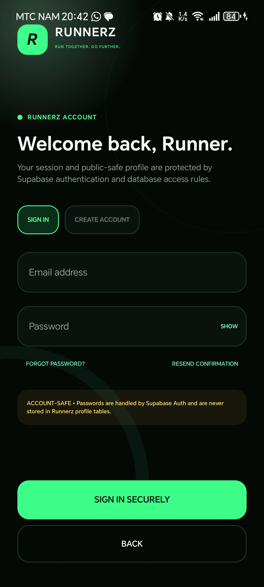 | 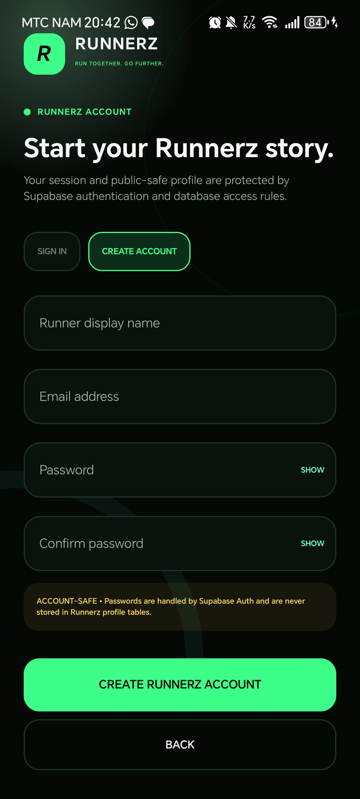 |

| Password recovery | Authenticated password update |
|---|---|
| 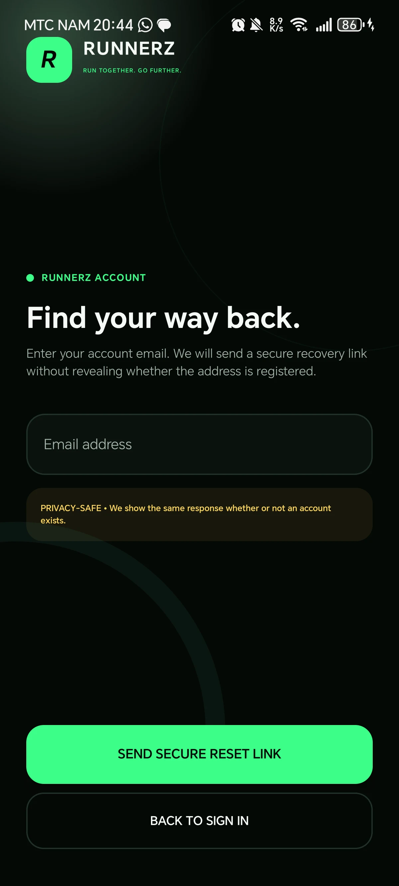 | 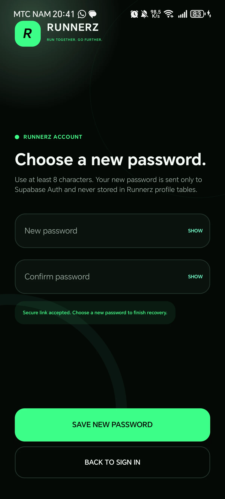 |

| Matches | Routes | Route confidence |
|---|---|---|
| 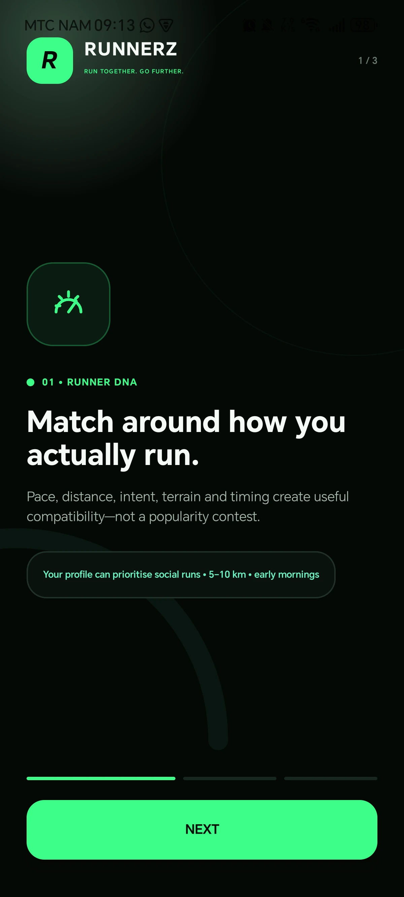 | 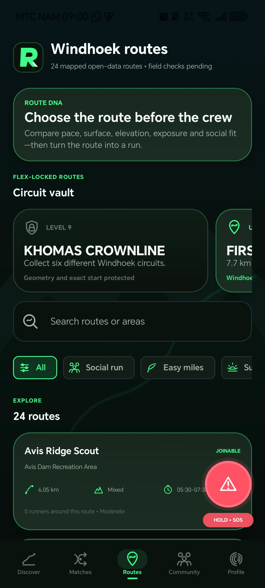 | 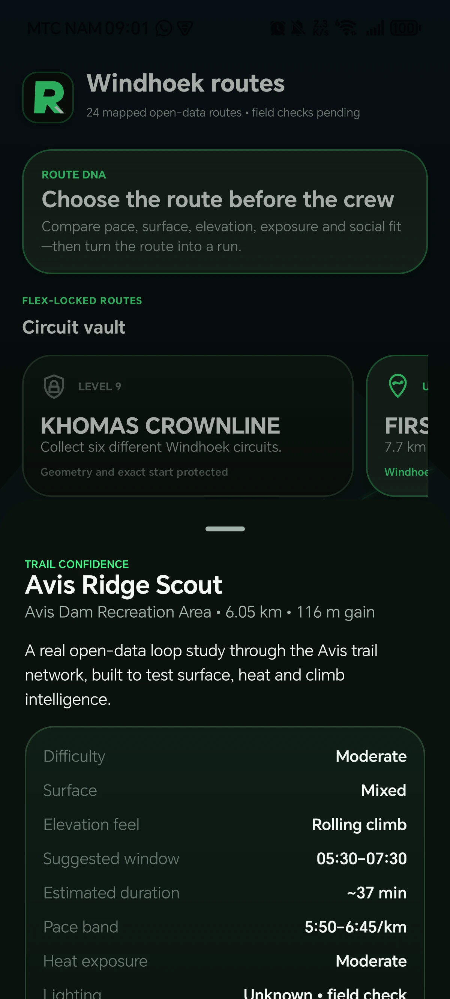 |

| Discover | Community | Founder profile |
|---|---|---|
| 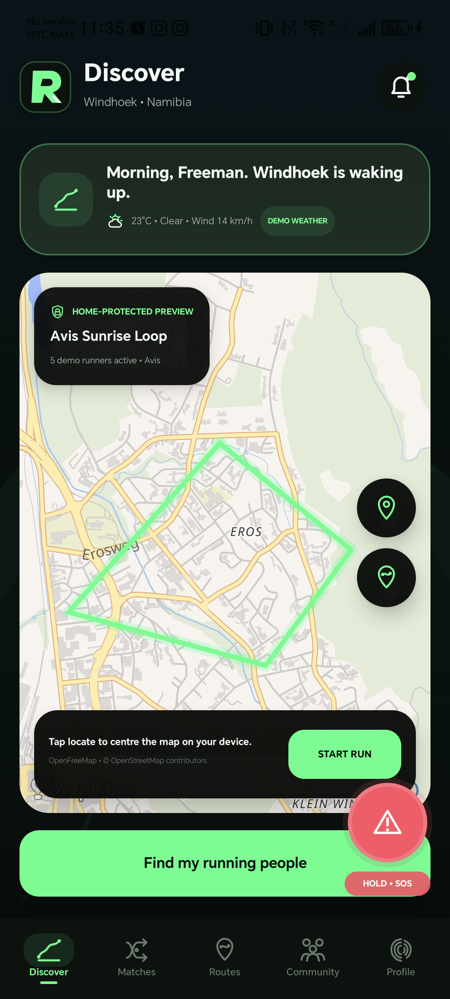 | 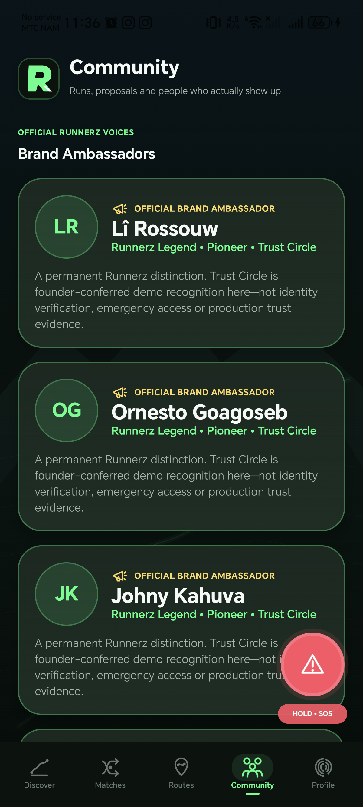 | 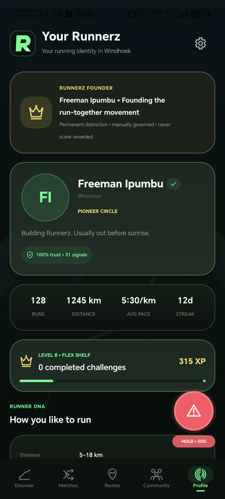 |

| Governed badge shelf | Privacy-safe share studio | Emergency quick dial |
|---|---|---|
| 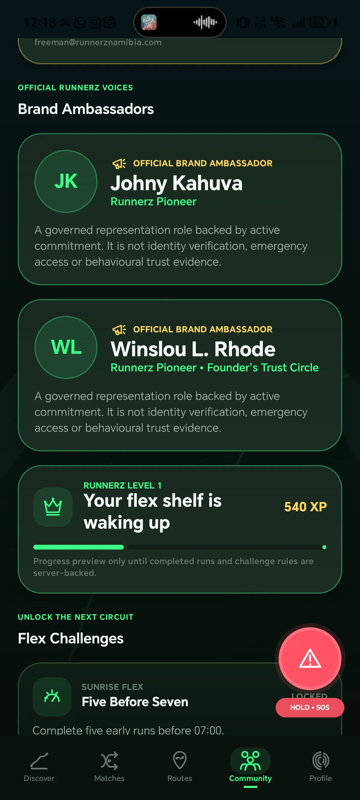 | 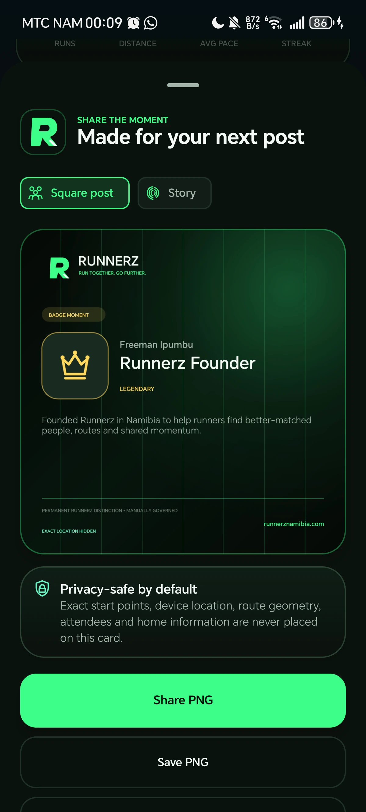 | 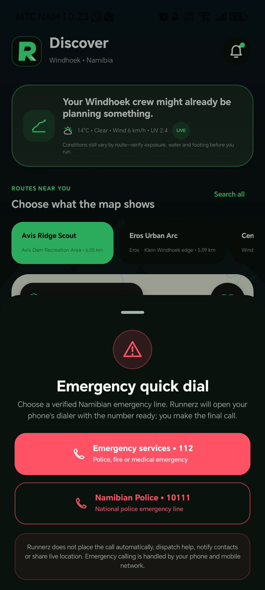 |

| Ranked meetup options on the live route map |
|---|
| 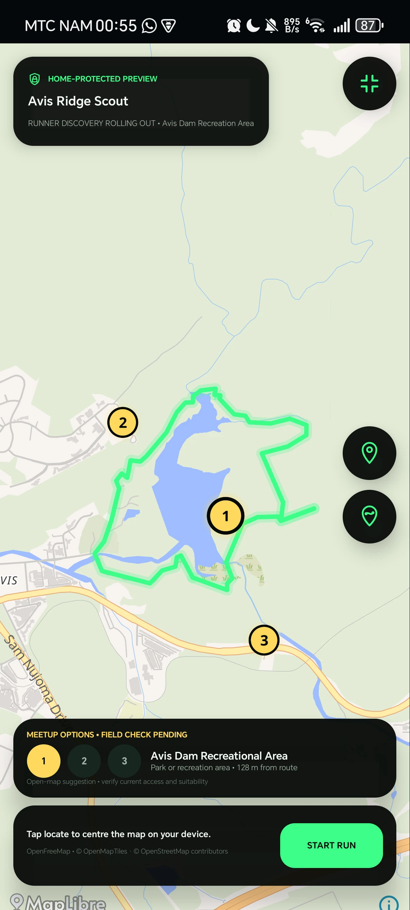 |

The earlier completion capture has been retired from this gallery. It used wording that could imply verified distance was banked by a timer-only session. A replacement will be added after physical-device validation of the revised screen.

## Design science approach

1. **Observe** — study why informal run coordination stalls between interest and action.
2. **Frame** — define the matching, trust, location and safety problems without inventing certainty.
3. **Design** — turn the run-forming loop into visible, testable interaction states.
4. **Build** — implement one canonical Kotlin/Compose architecture rather than parallel demo systems.
5. **Evaluate** — test on a physical Android device, including maps, back behaviour, permissions and constrained screen states.
6. **Harden** — separate identity verification from earned trust and keep unimplemented safety actions explicit.

## Engineering overview

- Kotlin and Jetpack Compose
- Android SDK 36 with minimum SDK 26
- MapLibre behind a provider-neutral map boundary
- Supabase authentication, PostgREST and versioned SQL migrations
- PKCE-backed Android confirmation and password-recovery callbacks
- Firebase Cloud Messaging transport and private App Distribution
- Ktor networking and DataStore preferences
- Real-device install and regression testing
- Provider-neutral route and location domain models

## Safety boundary

Runnerz does not represent suggested routes or meetup points as field-verified merely because they exist in open map data. It does not claim that emergency contacts, live tracking, navigation or safety services were activated unless a real provider and permission state support that claim.

Exact personal locations and private homes are not part of the public product story.

## Current status

The canonical Android implementation remains private. Live and Field Test are separate applications; distribution is controlled through Firebase App Distribution. Historical screenshots above are not a statement of the currently distributed build.

The September completion regression work moves celebration feedback above the expanded-map window, keeps it available until dismissal, queues simultaneous completion and badge events, and supports scrolling at larger text sizes. Timer completion is distinct from GPS recording, verified distance and earned performance credit. Automated checks and physical-device acceptance are reported separately; the revised screen is awaiting its next physical-device pass.

Account creation, email confirmation, visible-password controls, matching-password validation, resend confirmation, privacy-safe recovery and authenticated in-app password updates are connected to Supabase Auth. A real founder recovery uncovered a callback/session race; the release now waits for the genuine authenticated recovery session before exposing the password-update form.

Core route discovery, matching, community, editable profiles, lawful SOS dialling and notification foundations have been built and exercised. The route map now renders the full ranked two-to-three-option public meetup set for each catalogue or live-backed route, with selection, camera focus and an explicit field-check boundary. The live backend also passes 102 pgTAP assertions across schema, RLS, growth and private push delivery. Wider cohort validation, field verification, release signing and store review remain deliberate gates rather than launch claims.

## Repository boundary

This public repository intentionally excludes deployable Android source, database migrations, backend identifiers, private user information, environment files, signing material and internal infrastructure.

Security concerns should be sent privately to [info@runnerznamibia.com](mailto:info@runnerznamibia.com).

---

© 2026 Runnerz Namibia. Product and brand material is shared for portfolio viewing. No licence is granted to reproduce the product, identity or documentation.
